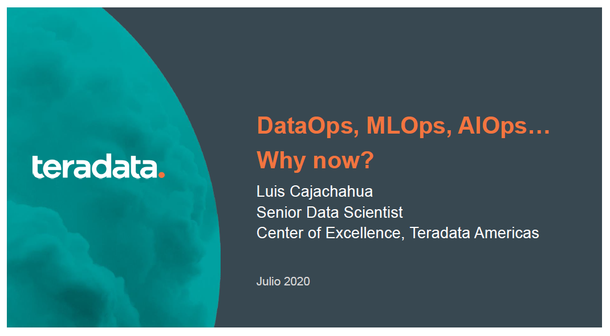

# Webinar DMC: DataOps, MLOps, AIOps... Why-now?

Materiales del Webinar del 10-Jul-2020

Puedes descargar la presentación haciendo clic derecho y eligiendo la opción "Descargar Como.." en este [ENLACE](docs/OpsWhyNow.pdf)

Y desde aquí puedes acceder a la [grabación](https://es-la.facebook.com/datamining.pe/videos/vb.101915079868800/732000480913804/) en Facebook:

## Referencias

La presentación ha sido desarrollada teniendo en cuenta los siguientes artículos.

1. [Why AnalyticOps Empowers Automation and AI](https://www.teradata.com/Blogs/Why-AnalyticOps-Empowers-Automation-and-AI)

2. [Automating MLOps, DevOps, and DataOps for Data Scientists and ML Teams](https://blog.netapp.com/data-science-pipeline-solution)

3. [MLOps: Machine Learning Operationalization](https://www.activestate.com/wp-content/uploads/2018/10/webinar-slides-mlops.pdf)

4. [MLOps Conference](https://www.youtube.com/watch?v=4dpGx8peO9w&list=PLH8M0UOY0uy6d_n3vEQe6J_gRBUrISF9m)

5. [Deploy your machine learning pipelines](https://medium.com/@igorzabukovec/deploy-your-machine-learning-pipelines-28007b985202)

6. [Data scientists, you can’t not-know APIs & Dockers](https://www.datasciencecentral.com/profiles/blogs/data-scientists-you-can-t-not-know-apis-amp-dockers)

7. [DataOps, la disciplina de datos emergente que toda empresa deseará](https://blogthinkbig.com/dataops-tecnologia-datos-emergente)

8. [Qué es DataOps y cómo puede ofrecer mejores análisis funcionales](https://discoverthenew.ituser.es/predictive-analytics/2018/03/que-es-dataops-y-como-puede-ofrecer-mejores-analisis-funcionales)

9. [Creating a Culture of Analytics with the Alation Data Catalog and Tableau](https://tc-europe19.tableau.com/learn/sessions/912?_ga=2.208544091.850077532.1594346465-105413372.1589231910)

